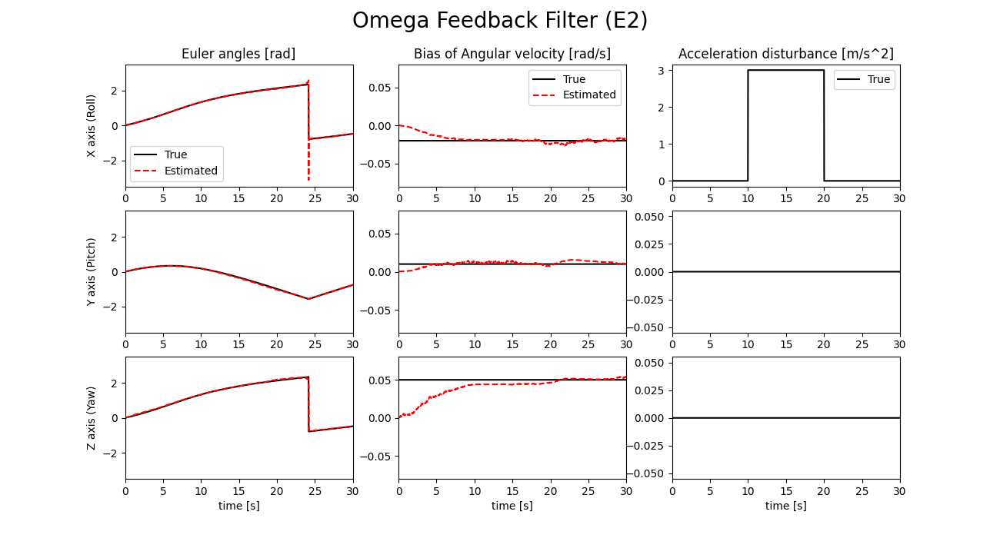

# 外乱判定式にE2を使用

外乱判定式E2を用いて外乱検知を行います。

## 実行方法

```
cargo run && python3 data_plot.py
```

## 実行結果



上図のシミュレーション条件は、以下の通り。
* サンプリング周期：0.02 s
* 角速度バイアス[x, y, z]：[-0.02, 0.01, 0.05] rad/s
* 角速度計測値に加わるノイズ分散：0.0001
* 加速度　　　　　　〃　　　　　：0.01
* 地磁気　　　　　　〃　　　　　：0.01
* $\alpha$ = 1.0
* $\beta$ = 0.2
* $\varepsilon_1$ = 0.04
* $\varepsilon_2$ = 0.08